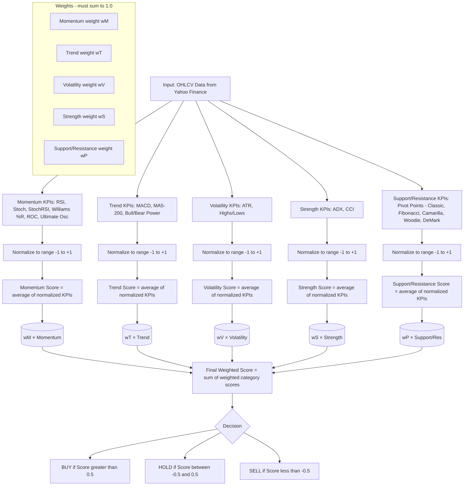

# 📊 Stock KPI Scoring Dashboard

A web-based dashboard for evaluating stocks daily using multiple KPIs (**RSI, MACD, ADX, ATR, Moving Averages, CCI, Stochastic, Williams %R, ROC, Ultimate Oscillator, and Pivot Points**).  
The app ranks tickers with a **weighted scoring system** and outputs **BUY / HOLD / SELL** signals and a global score per ticker.

Built with **Streamlit**, deployable on **Railway**.  
Data is pulled from **Yahoo Finance** using the [`yfinance`](https://github.com/ranaroussi/yfinance) library.

---

## 🚀 Features
- Upload an **Excel or CSV** with a list of tickers (up to 250+).
- Enter **custom weights** for:
  - Momentum  
  - Trend  
  - Volatility  
  - Strength  
  - Support/Resistance  
- Run analysis and view results in a live interactive table.
- Download results as an **Excel file** with scores and signals.
- Simple to deploy on **Railway** or run locally.

---

## 📡 Data Source
- The system pulls **historical stock data (OHLCV)** directly from **Yahoo Finance** via the `yfinance` Python library.  
- Technical indicators (RSI, MACD, ATR, ADX, CCI, Stochastic, Williams %R, ROC, Ultimate Oscillator, Moving Averages, Pivot Points) are then **calculated locally** using [`pandas_ta`](https://github.com/twopirllc/pandas-ta).  
- This ensures consistent results across tickers without relying on external pre-computed feeds.  

---

## 📊 How the Scoring Works

For each ticker, the system calculates scores across five key categories:

- **Momentum** → captures short-term signals (overbought/oversold).  
- **Trend** → measures the direction of the stock’s movement.  
- **Volatility** → tracks how strongly the price is moving day to day.  
- **Strength** → evaluates the reliability of the current trend.  
- **Support/Resistance** → positions the price relative to pivot levels.  

Each category produces a **normalized score**, and the user assigns weights to reflect its importance.  
These are combined into a **Final Weighted Score per ticker**.

The Final Score allows you to **rank and compare multiple stocks daily**, making it easy to filter which tickers are potential **BUY, HOLD, or SELL** candidates.

---
## 🔄 How the Scoring Normalization Works


----
🔧 Developer Notes

Input file must contain a column named Ticker.

Skip invalid tickers but keep them in the results with an “Error” message.

Enforce or auto-normalize weights to sum = 1.0 (to ensure scores are consistent and comparable).

Thresholds for BUY / HOLD / SELL should be configurable via the dashboard.

Output Excel should include:

Ticker

Current price

Category Scores (Momentum, Trend, Volatility, Strength, Support/Resistance)

Final Weighted Score

Signal

Show results in a sortable Streamlit table before download.

Add a progress bar for large ticker lists (250+).

Deployment on Railway with Procfile and requirements.txt.
---
## 📦 Requirements
Python 3.9+
Libraries:
streamlit
yfinance
pandas
pandas_ta
numpy
openpyxl

Install dependencies:
```bash
pip install -r requirements.txt
